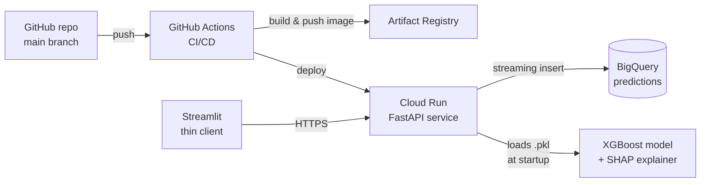
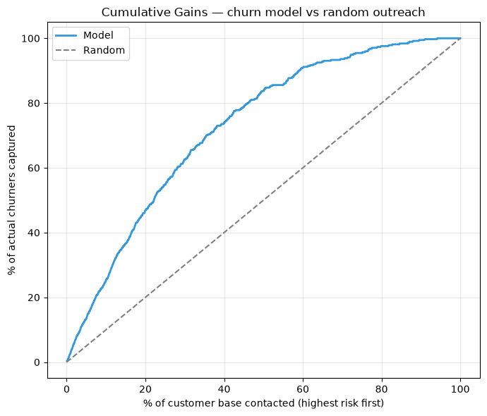
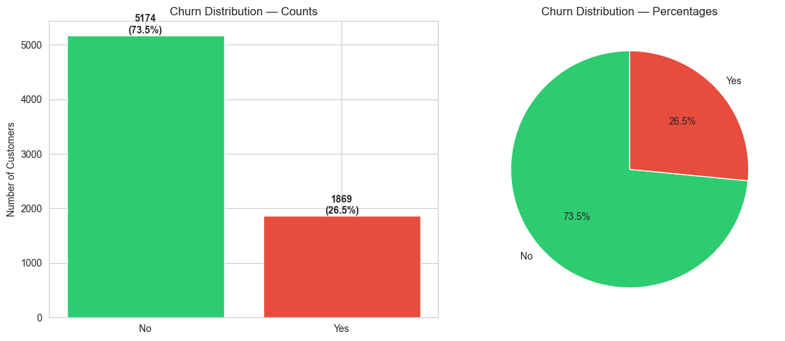
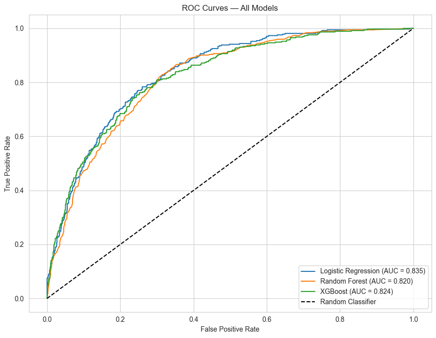
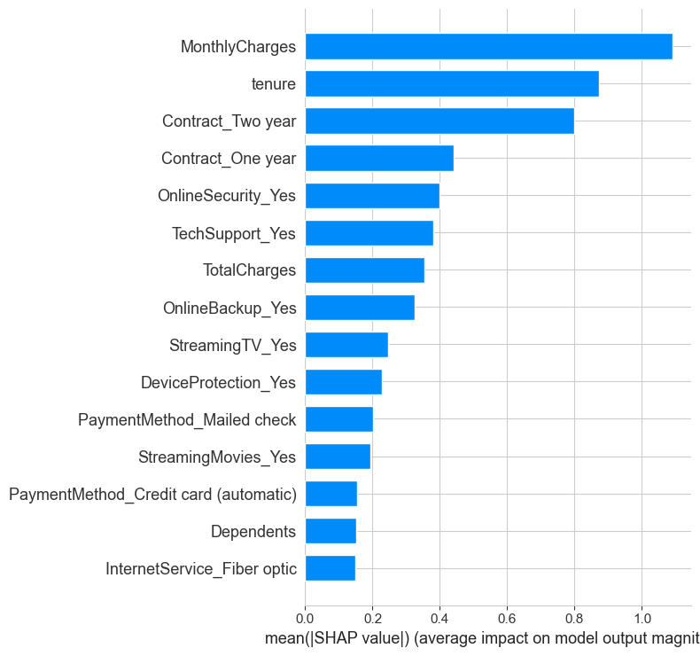

# Customer Churn Prediction — Production ML on GCP

End-to-end ML system: a tuned **XGBoost** churn classifier (ROC-AUC 0.81) served as a containerised **FastAPI** REST API on **Google Cloud Run**, with per-prediction **SHAP** explanations, **BigQuery** prediction logging, and CI/CD via **GitHub Actions**. Every push to `main` runs tests, builds the image, pushes to Artifact Registry, and redeploys in under 4 minutes.

## Live Demo

- **Swagger UI** (try the API in your browser): https://churn-api-968675945252.europe-west2.run.app/docs
- **Streamlit frontend**: https://customer-churn-prediction-pta8ejjyrq8ahuxaeuwzzb.streamlit.app/

[](https://customer-churn-prediction-pta8ejjyrq8ahuxaeuwzzb.streamlit.app/)


## Why this matters

Retaining an existing customer is **5–7× cheaper** than acquiring a new one. On a 7,000-customer base with a 27% churn rate, this system surfaces the ~1,900 highest-risk customers and explains *why* each one is at risk — turning a vague "we're losing customers" problem into a prioritised, defensible call list for the retention team.

## Architecture



## Endpoints

| Method | Path            | Description |
|--------|-----------------|-------------|
| GET    | `/health`       | Liveness probe used by Cloud Run. |
| POST   | `/predict`      | Single-customer churn prediction with SHAP top-5 features. |
| GET    | `/docs`         | Auto-generated Swagger UI. |
| GET    | `/openapi.json` | Machine-readable OpenAPI spec. |

## Tech Stack

**Serving** — FastAPI · Pydantic · uvicorn · Docker
**Cloud** — Cloud Run · Artifact Registry · BigQuery · Cloud Build
**ML** — XGBoost · scikit-learn · SHAP · imbalanced-learn (training only)
**Frontend** — Streamlit (thin client, HTTP-only)
**Ops** — GitHub Actions · pytest

## Dataset

**IBM Telco Customer Churn** — 7,043 customers, 21 features, ~27% churn rate. Source: [Kaggle](https://www.kaggle.com/datasets/blastchar/telco-customer-churn).

## Pipeline

1. **Cleaning** — fixed `TotalCharges` whitespace values; cast to numeric.
2. **EDA** — five visualisations uncovering churn drivers (contract, tenure, charges, services).
3. **Feature engineering** — binary + one-hot encoding, 30 final features.
4. **Preprocessing** — stratified 80/20 split, `StandardScaler` fit on train only, SMOTE on training fold only.
5. **Model comparison** — Logistic Regression, Random Forest, XGBoost (5-fold stratified CV).
6. **Hyperparameter tuning** — `GridSearchCV` over 108 XGBoost configurations.
7. **Explainability** — SHAP feature importance, beeswarm, per-customer waterfall.
8. **Deployment** — FastAPI on Cloud Run + Streamlit thin client + GitHub Actions CI/CD.

## Results

| Metric  | Tuned XGBoost |
|---------|---------------|
| ROC-AUC | 0.8080 |
| F1      | 0.5914 |
| Accuracy | 0.7637 |

### Ranking quality — does the risk list actually work?

Accuracy alone doesn't tell a retention team whether the call list is worth
working. What matters is: *if I contact the highest-risk customers first, how
many actually churn?* Measured on the held-out test set (1,409 customers, 26.5%
base churn rate) via `evaluation/rank_metrics.py`:

| Contacted (highest-risk first) | Precision | Churners captured | Lift vs random |
|---|---|---|---|
| Top 5%  | 71.4% | 13.4% | 2.69× |
| Top 10% | 67.4% | 25.4% | 2.54× |
| Top 20% | 62.1% | 46.8% | 2.34× |
| Top 30% | 55.3% | 62.6% | 2.08× |

So working the top 10% of the base means **~2 in 3 contacted customers are real
churners** — a **2.5× lift** over untargeted outreach — and the top 30% captures
**63% of all churners**. That is what turns the model into a prioritised call
list rather than a number.



### Key EDA insights

- **27%** of customers churned — class imbalance handled with SMOTE on the training fold only.
- **Month-to-month** contracts churn at ~43% vs under 3% for two-year contracts.
- Customers without TechSupport, OnlineSecurity, or OnlineBackup churn at materially higher rates.
- Most churners leave within the first few months of tenure.
- Higher MonthlyCharges correlate with higher churn, especially on fibre-optic internet.

### Sample visualisations

| Churn Distribution | ROC Curves | SHAP Feature Importance |
|---|---|---|
|  |  |  |

## Project layout

```
customer-churn-prediction/
├── .github/workflows/deploy.yml   # CI/CD: test → build → push → deploy
├── bigquery/
│   ├── predictions_schema.json    # BQ table schema
│   └── queries/                   # 3 monitoring SQL queries
├── notebooks/
│   └── churn_prediction.ipynb     # Training pipeline
├── src/
│   ├── inference.py               # Pure-function inference core
│   ├── api.py                     # FastAPI service
│   ├── bq_logger.py               # Fail-soft BigQuery logger
│   └── app.py                     # Streamlit thin client
├── tests/
│   ├── conftest.py
│   └── test_inference.py          # Smoke tests run in CI
├── models/                        # Serialised model + scaler + feature names
├── data/                          # Telco CSV (Kaggle)
├── images/                        # EDA + evaluation PNGs
├── Dockerfile
├── requirements-prod.txt          # Slim runtime deps for the container
├── requirements.txt               # Full dev deps
└── RUNBOOK.md                     # Manual GCP / GitHub setup steps
```

## Local development

```bash
pip install -r requirements.txt

# 1. start the API
cd src && uvicorn api:app --reload --port 8000

# 2. (in another terminal) start Streamlit
streamlit run src/app.py
```

http://localhost:8000/docs for Swagger; http://localhost:8501 for Streamlit.

## Run via Docker

```bash
docker build -t churn-api .
docker run -p 8080:8080 -e PORT=8080 churn-api
```

## Deploy to Cloud Run

See `RUNBOOK.md` for one-time GCP setup. Subsequent pushes to `main` auto-deploy.

## Monitoring

`bigquery/queries/` contains three SQL queries against the `predictions` table:

1. **Daily volume** — sanity check that traffic is reaching the service.
2. **Risk-level distribution** — proportion of LOW / MEDIUM / HIGH outcomes over the past 7 days.
3. **Drift check** — observed churn rate vs the training rate (~27%) per day. Sustained drift is the trigger to retrain.

## Known limitations

- Probabilities are not calibrated (Platt / isotonic would help).
- No temporal validation — production should use a time-based split.
- No automated drift alerting (Tier 2: Vertex AI Pipelines + Looker Studio).
- Feature `gender` retained for parity with the source dataset; a fairness audit is recommended before real use.

## Author

**Prince Okunade** — princeokunade1@gmail.com
