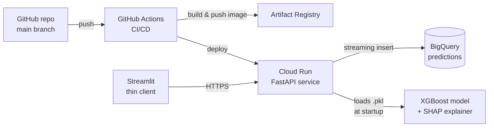

# Customer Churn Prediction — Production ML on GCP

End-to-end ML system: **XGBoost** churn predictions exposed as a containerised **FastAPI** service, deployed on **Google Cloud Run**, with prediction logging to **BigQuery** and CI/CD via **GitHub Actions**. SHAP explanations are surfaced at the API response level so any downstream consumer can show per-prediction reason codes.

**Live demo** — try the API in the browser:
- **Swagger UI**: https://churn-api-968675945252.europe-west2.run.app/docs
- **Streamlit frontend**: https://customer-churn-prediction-pta8ejjyrq8ahuxaeuwzzb.streamlit.app/

[](https://customer-churn-prediction-pta8ejjyrq8ahuxaeuwzzb.streamlit.app/)


## Architecture



## Problem

Customer churn costs subscription businesses far more than acquisition — retaining an existing customer is 5–7× cheaper than acquiring a new one. This system predicts, per customer, the probability of churn and explains each prediction with SHAP so retention teams can take targeted, defensible action.

## Endpoints

| Method | Path            | Description |
|--------|-----------------|-------------|
| GET    | `/health`       | Liveness probe used by Cloud Run. |
| POST   | `/predict`      | Single-customer churn prediction with SHAP top-5 features. |
| GET    | `/docs`         | Auto-generated Swagger UI (try requests in the browser). |
| GET    | `/openapi.json` | Machine-readable OpenAPI spec. |

## Tech Stack

**Serving** — FastAPI · Pydantic · uvicorn · Docker
**Cloud** — Cloud Run · Artifact Registry · BigQuery · Cloud Build
**ML** — XGBoost · scikit-learn · SHAP · imbalanced-learn (training only)
**Data / Frontend** — pandas · NumPy · Streamlit (thin client)
**Ops** — GitHub Actions · pytest

## Dataset

**IBM Telco Customer Churn** — 7,043 customers, 21 features, ~27% churn rate.
Source: [Kaggle](https://www.kaggle.com/datasets/blastchar/telco-customer-churn).

## Pipeline

1. **Data Cleaning** — fixed `TotalCharges` whitespace values; converted to numeric.
2. **EDA** — five visualisations uncovering churn drivers (contract type, tenure, charges, services).
3. **Feature Engineering** — binary + one-hot encoding (`drop_first=True`), 30 final features.
4. **Preprocessing** — stratified 80/20 split, `StandardScaler` (fit on train only), SMOTE on training set only.
5. **Model Comparison** — Logistic Regression, Random Forest, XGBoost (5-fold stratified CV).
6. **Hyperparameter Tuning** — `GridSearchCV` over 108 XGBoost configurations.
7. **Explainability** — SHAP feature importance, beeswarm, and per-customer waterfall plots.
8. **Deployment** — FastAPI on Cloud Run + Streamlit thin client, CI/CD via GitHub Actions.

## Results

| Metric  | Tuned XGBoost |
|---------|---------------|
| ROC-AUC | 0.8080 |
| F1      | 0.5914 |
| Accuracy | 0.7637 |

### Key EDA Insights

- **27%** of customers churned — class imbalance addressed with SMOTE (training fold only).
- **Month-to-month** contracts churn at ~43% vs under 3% for two-year contracts.
- Customers **without** TechSupport, OnlineSecurity, or OnlineBackup churn at significantly higher rates.
- Most churners leave within the **first few months** of tenure.
- Higher **MonthlyCharges** correlate with higher churn, especially on fibre-optic internet.

### Sample Visualisations

| Churn Distribution | ROC Curves | SHAP Feature Importance |
|---|---|---|
|  |  |  |

## Project Layout

```
customer-churn-prediction/
├── .github/workflows/deploy.yml   # CI/CD: test → build → push → deploy
├── bigquery/
│   ├── predictions_schema.json    # BQ table schema
│   └── queries/                   # 3 monitoring SQL queries
├── notebooks/
│   └── churn_prediction.ipynb     # Training pipeline (11 cells)
├── src/
│   ├── inference.py               # Pure-function inference core
│   ├── api.py                     # FastAPI service
│   ├── bq_logger.py               # Fail-soft BigQuery logger
│   └── app.py                     # Streamlit thin client
├── tests/
│   ├── conftest.py
│   └── test_inference.py          # Smoke tests run in CI
├── models/                        # Serialised model + scaler + feature names
├── data/                          # Training CSV (Telco, Kaggle)
├── images/                        # EDA + evaluation PNGs
├── Dockerfile
├── .dockerignore
├── requirements-prod.txt          # Slim runtime deps for the container
├── requirements.txt               # Full dev deps (training + frontend)
└── RUNBOOK.md                     # Manual GCP/GitHub steps
```

## Local development

```bash
# Install deps
pip install -r requirements.txt

# 1. start the API
cd src && uvicorn api:app --reload --port 8000

# 2. (in another terminal) start Streamlit
streamlit run src/app.py
```

Open http://localhost:8000/docs for the Swagger UI, or http://localhost:8501 for the Streamlit frontend.

## Run via Docker

```bash
docker build -t churn-api .
docker run -p 8080:8080 -e PORT=8080 churn-api
# → http://localhost:8080/docs
```

## Deploy to Cloud Run

See `RUNBOOK.md` for the one-time GCP setup. After that, every push to `main` auto-deploys via GitHub Actions.

## Monitoring

`bigquery/queries/` contains three SQL queries that run against the `predictions` table:

1. **Daily volume** — sanity check that traffic is reaching the service.
2. **Risk-level distribution** — proportion of LOW / MEDIUM / HIGH outcomes over the past 7 days.
3. **Drift check** — observed churn rate vs the training-set rate (~27%) per day.

A sustained drift delta is the trigger to retrain.

## Known Limitations

- Probabilities are not calibrated (Platt / isotonic regression would help).
- No temporal validation — production should use a time-based split.
- No automated drift alerting (Tier 2 — Vertex AI Pipelines + Looker Studio).
- Feature `gender` retained for parity with the dataset; a fairness audit is recommended before real use.

## Author

Prince Okunade — princeokunade1@gmail.com
